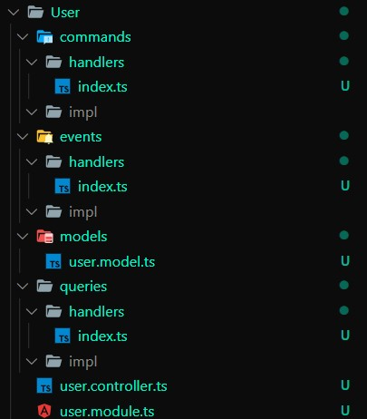
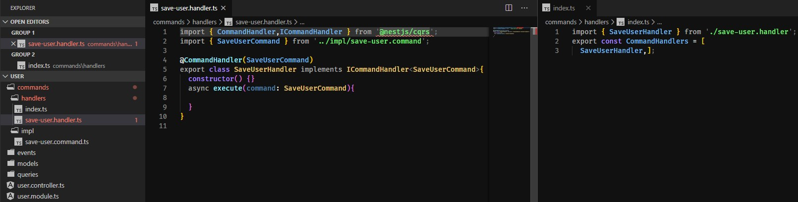

# nest-cqrs-poor-cli
Python script that support creating new working directory for NestCQRS which is same as in the [orginal docs](https://docs.nestjs.com/recipes/cqrs). 

## Commands
* py script.py ***m User***

Creates CQRS working directory.

* py script.py ***c/q/e example-name***

Creates command/query/event implementation and handler, pins it to appropriate array of (Command||Query||Event)Handlers found on each handler directory at index.ts.

## Personalization
In the code you can find comments which will help you to customize your builds. By now you can customize:
* Providers, modules and controllers in **modules**,
* Imports accross **modules/commands/events/queries** (both implementation and handlers parts),
* Handling functions **commands/events/queries**,
* Constructor parameters in **commands/events/queries**.

## Globally accessible script
**Windows**

Add to your system variables `PATH` directory which contains the `script.py`. 

Then in this directory create `example.bat` file containing:
`py "C:\path\to\the\script.py" %1 %2`.

Afterwards you can type anywhere `example.bat m User`.

## Note
To get working creating commands/queries/event the directory must follow the offical pattern and script must be executed in this directory.
